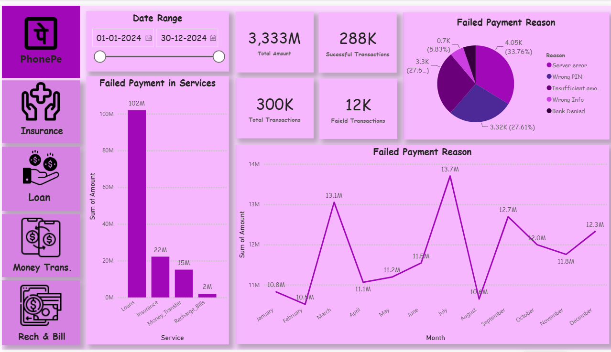
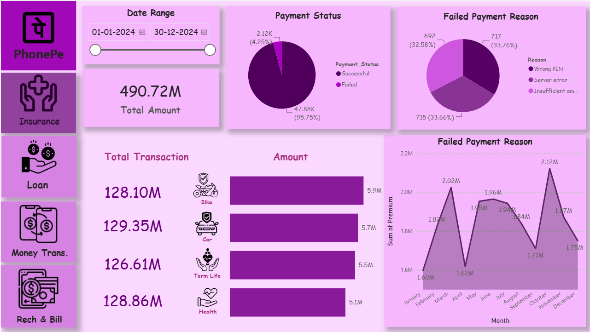
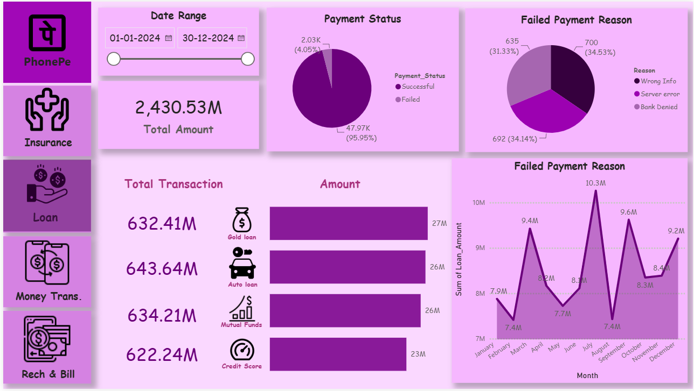
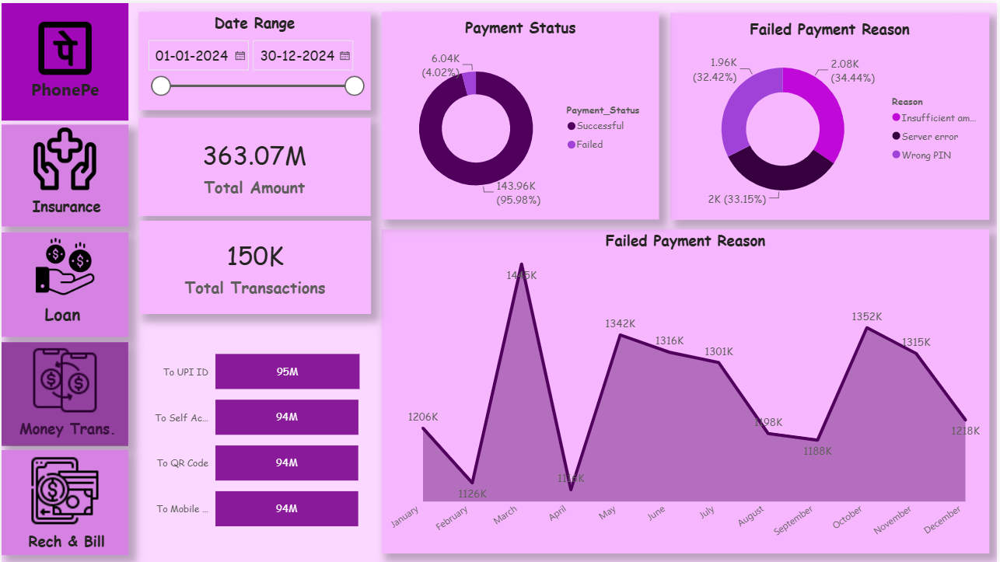
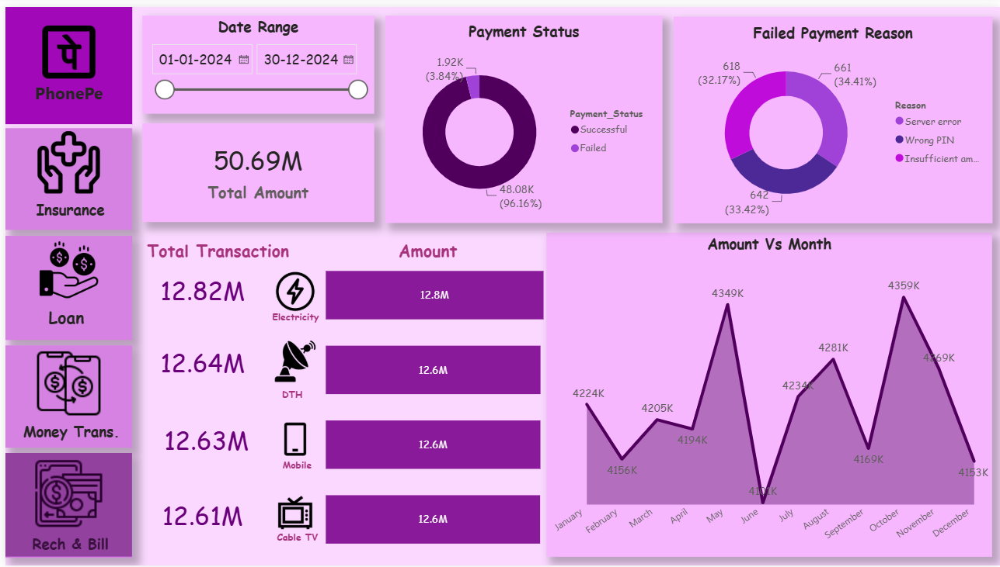

# 📊 PhonePe Transaction Analytics Dashboard

> An interactive **Power BI dashboard** for analyzing digital payment transactions, service performance, transaction trends, payment status, and business insights.

---

## 📌 Project Overview

This project focuses on analyzing **PhonePe transaction data** using Microsoft Power BI.

The dashboard transforms transaction-level data into an interactive analytical report covering multiple digital payment services:

- 🛡️ Insurance
- 💰 Loans
- 💸 Money Transfer
- 📱 Recharge & Bills

The objective is to understand transaction behavior, identify trends, compare service performance, and generate meaningful business insights from the data.

---

## 🎯 Business Problem

Digital payment platforms generate a large amount of transaction data every day.

Without proper analysis, it can be difficult to understand:

- How transaction activity changes over time
- Which services generate the highest transaction value
- How many transactions are successful or failed
- Which categories contribute the most value
- What are the most common transaction reasons
- Which service areas require further investigation

This dashboard provides an interactive way to explore these questions and convert raw transaction data into useful business information.

---

## 🎯 Project Objectives

The main objectives of this project are:

- Analyze overall transaction performance
- Measure total transaction volume and value
- Analyze successful and failed transactions
- Identify monthly transaction trends
- Compare different digital payment services
- Analyze insurance transactions
- Analyze loan transactions
- Analyze money-transfer activity
- Analyze recharge and bill payments
- Identify high-performing categories
- Generate actionable business insights

---

## 📋 Business Questions

### 🏠 Overall Analysis

1. What is the total number of transactions?
2. What is the total transaction amount?
3. How many transactions were successful?
4. How many transactions failed?
5. How does transaction value change over time?
6. Which service contributes the highest transaction value?
7. What are the most common transaction reasons?

### 🛡️ Insurance Analysis

1. What is the total insurance premium?
2. How does insurance activity change over time?
3. Which insurance type contributes the highest value?
4. What is the payment-status distribution?
5. Which insurance categories have the highest transaction activity?

### 💰 Loans Analysis

1. What is the total loan amount?
2. Which loan type contributes the highest value?
3. How does loan activity change over time?
4. What is the payment-status distribution?
5. Which loan categories have the highest transaction activity?

### 💸 Money Transfer Analysis

1. What is the total money-transfer amount?
2. Which transfer type contributes the highest value?
3. How does transfer activity change over time?
4. What are the most common transfer reasons?
5. What is the successful vs failed transaction distribution?

### 📱 Recharge & Bills Analysis

1. What is the total recharge and bill-payment amount?
2. Which recharge/bill category contributes the highest value?
3. How does payment activity change over time?
4. What are the most common payment reasons?
5. What is the successful vs failed payment distribution?

---

## 📈 Key Performance Indicators

| KPI                      | Description                           |
|--------------------------|---------------------------------------|
| Total Transactions       | Total number of transactions          |
| Total Transaction Amount | Total value of transactions           |
| Successful Transactions  | Number of successful transactions     |
| Failed Transactions      | Number of failed transactions         |
| Total Insurance Premium  | Total insurance premium value         |
| Total Loan Amount        | Total loan amount                     |
| Total Money Transfer     | Total money-transfer value            |
| Total Recharge & Bills   | Total recharge and bill-payment value |

---

## 🛠️ Tools & Technologies

| Technology               | Purpose                                   |
|--------------------------|-------------------------------------------|
| **Microsoft Power BI**   | Dashboard development and visualization   |
| **Power Query**          | Data transformation and preparation       |
| **DAX**                  | Measures and analytical calculations      |
| **Excel / Tabular Data** | Data source                               |
| **GitHub**               | Project documentation and version control |

---

## 🔄 Data Analysis Workflow

The project follows a standard data-analysis workflow:

```text
Raw Data
   ↓
Data Cleaning
   ↓
Data Transformation
   ↓
Data Modeling
   ↓
Data Visualization
   ↓
Dashboard
   ↓
Business Insights
```

### 1. Data Preparation

The transaction data was prepared for analysis by organizing the required fields and ensuring that the data could be analyzed across different services and time periods.

### 2. Data Transformation

Power Query was used for data preparation and transformation where required.

### 3. Data Modeling

The report contains service-specific analytical areas including:

- `All_Transactions`
- `Insurance`
- `Loans`
- `Money_Transfer`
- `Recharge_Bills`

### 4. Data Analysis

DAX and Power BI visuals were used to calculate and analyze transaction metrics, trends, categories, and payment status.

### 5. Visualization

Interactive charts, KPI cards, filters, and category-based visualizations were used to create the final dashboard.

---

# 📊 Dashboard

The Power BI report contains five major analytical pages.

## 🏠 1. Home Dashboard

Provides an overall view of transaction activity and service performance.



---

## 🛡️ 2. Insurance Analysis

Analyzes insurance premium values, insurance types, transaction trends, and payment status.



---

## 💰 3. Loans Analysis

Analyzes loan amounts, loan categories, monthly trends, and payment status.



---

## 💸 4. Money Transfer Analysis

Analyzes transfer amount, transfer type, transaction reasons, trends, and payment status.



---

## 📱 5. Recharge & Bills Analysis

Analyzes recharge and bill-payment amounts, categories, trends, and payment status.



---

# 💡 Key Insights

The following section should contain insights calculated from the actual dashboard.

### 📊 Overall Performance

- Total transactions: **300K**
- Total transaction amount: **3333M**
- Successful transactions: **288K**
- Failed transactions: **12k**

### 🏆 Service Performance

- Highest transaction-value service: **Insurance**
- Highest transaction-volume service: **Recharge & Bills**
- Lowest transaction-value service: **Recharge & Bills**

### 📅 Monthly Trend

- Highest transaction-value month: **July**
- Lowest transaction-value month: **February**
- Major trend observed: **Transaction Value Increased steadily from April to July Before Decline In August**

### 🛡️ Insurance

- Highest-performing insurance type: **Car insurance**
- Highest premium month: **July**

### 💰 Loans

- Highest-performing loan category: **Auto Loan**
- Highest loan-value month: **July**

### 💸 Money Transfer

- Highest-performing transfer type: **UPI Transfer**
- Highest transfer-value month: **May**

### 📱 Recharge & Bills

- Highest-performing category: **Electricity**
- Highest payment-value month: **October**

> **Note:** The insights above should be replaced with actual values from the dashboard. Avoid publishing estimated or invented numbers.

---

# 📁 Project Structure

```text
PhonePe-Transaction-Analytics-Dashboard/
│
├── README.md
│
├── powerbi/
│   └── PhonePe_Transaction_Analytics.pbix
│
├── data/
│   └── Phonepe_Final_Dataset.xlsx
│
├── screenshots/
│   ├── home.png
│   ├── insurance.png
│   ├── loans.png
│   ├── money-transfer.png
│   └── recharge-bills.png
│
└── documentation/
    ├── data_dictionary.md
    └── insights.md
```

---

# 🚀 How to Use

### Step 1

Download the Power BI file:

```text
powerbi/PhonePe_Transaction_Analytics.pbix
```

### Step 2

Open the file using **Microsoft Power BI Desktop**.

### Step 3

If Power BI requests the original data source, update the data-source path.

### Step 4

Refresh the dataset.

### Step 5

Use the dashboard filters, slicers, and visualizations to explore the analysis.

---

# 📚 Skills Demonstrated

This project demonstrates practical skills in:

- Data Cleaning
- Data Transformation
- Data Modeling
- Power Query
- DAX
- KPI Development
- Data Visualization
- Time-Series Analysis
- Business Analysis
- Dashboard Development
- Business Insight Generation

---

# 📌 Project Highlights

### Data Analysis

✔ Transaction-level analysis  
✔ Service-level analysis  
✔ Category analysis  
✔ Monthly trend analysis  
✔ Payment-status analysis  

### Power BI

✔ Interactive dashboards  
✔ KPI cards  
✔ Filters and slicers  
✔ Trend analysis  
✔ Comparative visualizations  

### Business Intelligence

✔ Business-question driven analysis  
✔ Performance monitoring  
✔ Trend identification  
✔ Insight generation  

---

# 👨‍💻 Author

**Sourabh Mondal**

Data Analyst | Power BI | SQL | Excel | Python

---

# ⚠️ Disclaimer

This project is created for **educational and portfolio purposes**.

The dashboard should not be considered an official PhonePe business report unless the underlying dataset has been officially sourced and authorized.

Any dataset containing confidential, private, or personally identifiable information should not be published publicly.

---
